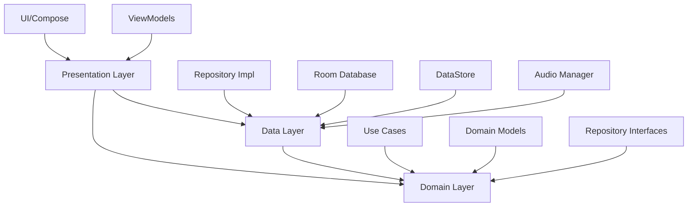
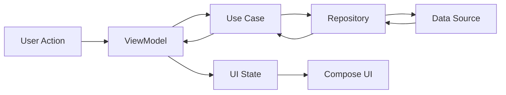

Nimaz follows Clean Architecture principles to ensure a maintainable, testable, and scalable codebase. The architecture is organized into three distinct layers, each with specific responsibilities.

## Architecture layers



<Note>
The domain layer is the core of the application and has no dependencies on Android framework or external libraries.
</Note>

## Domain layer

The domain layer contains business logic and is framework-agnostic.

### Structure

```
domain/
├── model/          # Domain models (data classes)
├── repository/     # Repository interfaces
└── usecase/        # Business logic use cases
```

### Domain models

Domain models represent business entities independent of data sources:

```kotlin
// Example: Prayer time types
enum class PrayerType {
    FAJR, SUNRISE, DHUHR, ASR, MAGHRIB, ISHA
}
```

### Repository interfaces

Define contracts for data operations without implementation details:

```kotlin
interface QuranRepository {
    suspend fun getSurahList(): List<Surah>
    suspend fun getAyahsBySurah(surahNumber: Int): List<Ayah>
    fun observeBookmarks(): Flow<List<QuranBookmark>>
}
```

### Use cases

Encapsulate single business operations. Nimaz uses grouped use cases for related functionality:

**Available use case groups:**
- `QuranUseCases` - Quran reading, bookmarks, favorites, progress tracking
- `KhatamUseCases` - Quran completion tracking, daily goals, statistics
- `AsmaUlHusnaUseCases` - 99 Names of Allah
- `AsmaUnNabiUseCases` - Names of Prophet Muhammad
- `ProphetUseCases` - Stories of 25 Prophets

**Example use case:**

```kotlin
class GetSurahListUseCase(private val repository: QuranRepository) {
    suspend operator fun invoke(): List<Surah> {
        return repository.getSurahList()
    }
}
```

<Accordion title="Why group use cases?">
Grouping related use cases provides several benefits:
- Easier dependency injection (inject one group vs. many individual use cases)
- Clear feature boundaries
- Simplified ViewModel constructors
- Better code organization
</Accordion>

## Data layer

The data layer implements repository interfaces and manages data sources.

### Structure

```
data/
├── audio/              # Adhan audio management
├── local/
│   ├── database/       # Room database
│   │   ├── dao/        # Data Access Objects
│   │   ├── entity/     # Room entities
│   │   └── NimazDatabase.kt
│   └── datastore/      # Preferences DataStore
└── repository/         # Repository implementations
```

### Room database

Nimaz uses Room for local data persistence with 30+ entities:

```kotlin
@Database(
    entities = [
        // Quran
        SurahEntity::class,
        AyahEntity::class,
        TranslationEntity::class,
        QuranBookmarkEntity::class,
        QuranFavoriteEntity::class,
        ReadingProgressEntity::class,
        SurahInfoEntity::class,
        // Hadith
        HadithBookEntity::class,
        HadithEntity::class,
        HadithBookmarkEntity::class,
        // ... 20+ more entities
    ],
    version = 10,
    exportSchema = true
)
abstract class NimazDatabase : RoomDatabase() {
    abstract fun quranDao(): QuranDao
    abstract fun hadithDao(): HadithDao
    abstract fun duaDao(): DuaDao
    // ... more DAOs
}
```

<Info>
The database uses migrations to preserve user data when the schema changes. See NimazDatabase.kt:124 for migration implementations.
</Info>

### Repository implementations

Repositories coordinate between local data sources:

**Available repositories:**
- QuranRepositoryImpl
- HadithRepositoryImpl
- DuaRepositoryImpl
- PrayerRepositoryImpl
- FastingRepositoryImpl
- TasbihRepositoryImpl
- ZakatRepositoryImpl
- TafseerRepositoryImpl
- KhatamRepositoryImpl
- AsmaUlHusnaRepositoryImpl
- AsmaUnNabiRepositoryImpl
- ProphetRepositoryImpl

```kotlin
class QuranRepositoryImpl @Inject constructor(
    private val quranDao: QuranDao
) : QuranRepository {
    override suspend fun getSurahList(): List<Surah> {
        return quranDao.getAllSurahs().map { it.toDomain() }
    }
    
    override fun observeBookmarks(): Flow<List<QuranBookmark>> {
        return quranDao.observeBookmarks().map { entities ->
            entities.map { it.toDomain() }
        }
    }
}
```

### DataStore preferences

User preferences are stored using Preferences DataStore:

```kotlin
class PreferencesDataStore @Inject constructor(
    private val dataStore: DataStore<Preferences>
) {
    val userPreferences: Flow<UserPreferences>
    val appLanguage: Flow<String>
    val fajrNotificationEnabled: Flow<Boolean>
    // ... more preferences
}
```

## Presentation layer

The presentation layer handles UI and user interactions using Jetpack Compose.

### Structure

```
presentation/
├── components/
│   ├── atoms/          # Basic UI components
│   ├── molecules/      # Composite components
│   └── organisms/      # Complex UI sections
├── screens/            # Feature screens
│   ├── home/
│   ├── quran/
│   ├── prayer/
│   ├── settings/
│   └── ... 15+ more
├── theme/              # Material3 theme
└── viewmodel/          # ViewModels
```

### Component hierarchy

Nimaz uses atomic design principles:

<Accordion title="Atoms">
Basic, reusable UI building blocks (buttons, text fields, icons)
</Accordion>

<Accordion title="Molecules">
Composite components built from atoms (cards, list items, toolbars)
</Accordion>

<Accordion title="Organisms">
Complex UI sections combining molecules (prayer time card, Quran reader header)
</Accordion>

### ViewModels

ViewModels manage UI state and coordinate use cases:

**Available ViewModels:**
- HomeViewModel
- QuranViewModel
- HadithViewModel
- DuaViewModel
- PrayerTrackerViewModel
- FastingViewModel
- TasbihViewModel
- ZakatViewModel
- KhatamViewModel
- AsmaUlHusnaViewModel
- AsmaUnNabiViewModel
- ProphetViewModel
- And more...

```kotlin
@HiltViewModel
class QuranViewModel @Inject constructor(
    private val quranUseCases: QuranUseCases,
    private val khatamUseCases: KhatamUseCases,
    private val preferencesDataStore: PreferencesDataStore
) : ViewModel() {
    
    private val _uiState = MutableStateFlow(QuranUiState())
    val uiState: StateFlow<QuranUiState> = _uiState.asStateFlow()
    
    fun loadSurah(surahNumber: Int) {
        viewModelScope.launch {
            val surah = quranUseCases.getSurahWithAyahs(surahNumber)
            _uiState.update { it.copy(currentSurah = surah) }
        }
    }
}
```

<Warning>
ViewModels should never hold references to Activity or View instances to avoid memory leaks.
</Warning>

## Dependency injection

Nimaz uses Hilt for dependency injection throughout all layers.

### DI modules

Located in `core/di/`:

**DatabaseModule.kt** - Provides Room database and DAOs
```kotlin
@Module
@InstallIn(SingletonComponent::class)
object DatabaseModule {
    @Provides
    @Singleton
    fun provideNimazDatabase(
        @ApplicationContext context: Context
    ): NimazDatabase {
        return Room.databaseBuilder(
            context,
            NimazDatabase::class.java,
            NimazDatabase.DATABASE_NAME
        ).addMigrations(
            NimazDatabase.MIGRATION_7_8,
            NimazDatabase.MIGRATION_8_9
        ).build()
    }
}
```

**DataStoreModule.kt** - Provides DataStore for preferences

**RepositoryModule.kt** - Binds repository implementations to interfaces
```kotlin
@Binds
@Singleton
abstract fun bindQuranRepository(
    quranRepositoryImpl: QuranRepositoryImpl
): QuranRepository
```

**UseCaseModule.kt** - Provides use case groups
```kotlin
@Provides
@Singleton
fun provideQuranUseCases(
    repository: QuranRepository
): QuranUseCases {
    return QuranUseCases(
        getSurahList = GetSurahListUseCase(repository),
        getSurahWithAyahs = GetSurahWithAyahsUseCase(repository),
        // ... more use cases
    )
}
```

### Application class

The app is initialized in `NimazApp.kt` with `@HiltAndroidApp`:

```kotlin
@HiltAndroidApp
class NimazApp : Application(), Configuration.Provider {
    @Inject lateinit var workerFactory: HiltWorkerFactory
    @Inject lateinit var prayerNotificationScheduler: PrayerNotificationScheduler
    
    override fun onCreate() {
        super.onCreate()
        applySavedLocale()
        scheduleInitialNotifications()
        downloadDefaultAdhanIfNeeded()
    }
}
```

## Data flow

The unidirectional data flow in Nimaz:



1. User interacts with Compose UI
2. UI calls ViewModel function
3. ViewModel invokes use case
4. Use case calls repository
5. Repository fetches/updates data
6. Data flows back through layers
7. ViewModel updates UI state
8. Compose UI recomposes with new state

## Best practices

<CardGroup cols={2}>
  <Card title="Single responsibility">
    Each class has one clear purpose and reason to change
  </Card>
  <Card title="Dependency inversion">
    Depend on abstractions (interfaces) not implementations
  </Card>
  <Card title="Reactive streams">
    Use Flow for observable data streams
  </Card>
  <Card title="Immutable state">
    UI state is immutable and updated via copy()
  </Card>
</CardGroup>

## Testing strategy

Each layer is independently testable:

- **Domain**: Test use cases in isolation with mocked repositories
- **Data**: Test repositories with fake data sources
- **Presentation**: Test ViewModels with fake use cases, test UI with Compose testing

```kotlin
// Example unit test
class GetSurahListUseCaseTest {
    @Test
    fun `invoke returns surah list from repository`() = runTest {
        val mockRepository = mockk<QuranRepository>()
        coEvery { mockRepository.getSurahList() } returns listOf(/*...*/)
        
        val useCase = GetSurahListUseCase(mockRepository)
        val result = useCase()
        
        assertThat(result).hasSize(114)
    }
}
```

<Tip>
When adding new features, create the domain layer first (models, repository interface, use cases), then implement the data layer, and finally build the UI.
</Tip>